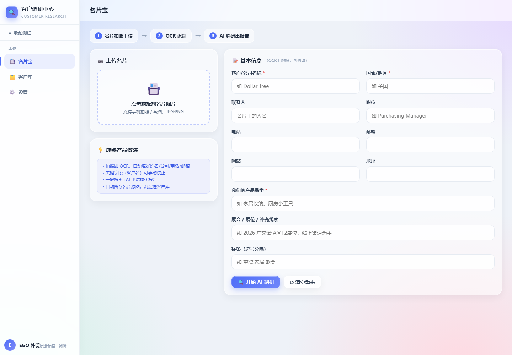
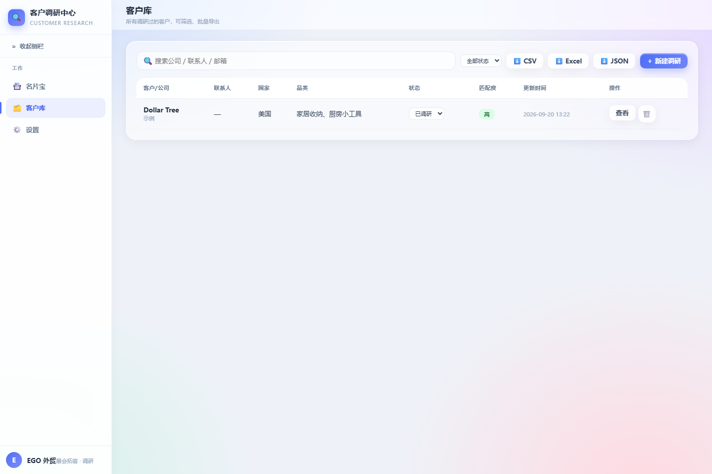
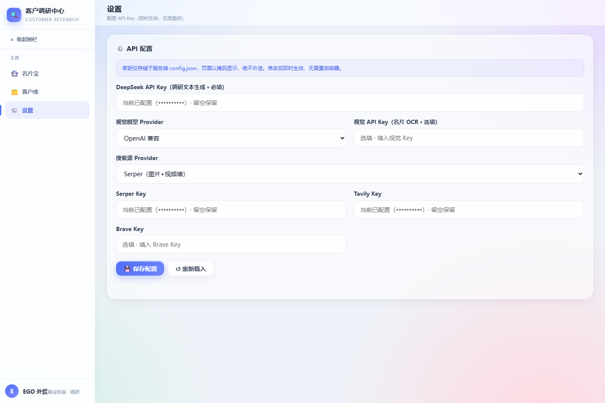

<div align="center">

# 名片宝 · Card Research Workspace

**名片拍照 → OCR 识别 → AI 客户调研 → 客户资产沉淀**

[](https://www.python.org/)
[](https://fastapi.tiangolo.com/)
[](https://www.docker.com/)

</div>

名片宝面向展会拓客与销售线索整理：上传一张名片照片，系统完成 OCR、可编辑字段校正、公开信息搜索和 AI 结构化调研，并把结果沉淀到可筛选、可导出的客户库。

> 数据与密钥说明：本项目不会提交 API Key、数据库、客户原始资料或部署环境配置。公开搜索结果仅用于辅助研判，请自行复核重要商业信息。

## ✨ 核心能力

- **名片 OCR**：支持拍照或上传图片；可使用 OpenAI 兼容视觉模型，未配置时自动回退本地 Tesseract。
- **人工校正**：OCR 后可修正客户姓名、公司、电话、邮箱、网站、国家及品类等字段。
- **AI 客户调研**：结合公开搜索与 DeepSeek，生成公司资料、渠道、采购风格、供应链、竞争、近期动态、合作匹配度等 10 个维度的结构化报告。
- **媒体富集**：配置 Serper、Brave 或 Tavily 后，调研报告可展示相关图片和视频卡片；默认 DuckDuckGo 文本搜索无需 Key。
- **客户资产库**：支持新建、已调研、已联系、商机等状态流转，以及关键词、国家、状态筛选。
- **批量导出**：客户库可导出 CSV、Excel 或 JSON，便于后续 CRM 或业务分析使用。

## 🖼️ 项目截图

<p align="center">
  
</p>

<p align="center">
  
</p>

<p align="center">
  
</p>

截图中的 API Key 已全部掩码，客户库仅展示公开示例企业。

## 🚀 快速启动

### Docker Compose（推荐）

```bash
git clone https://github.com/sean198604/customer-research.git
cd customer-research
cp .env.example .env
# 在 .env 中按需填写 API Key
docker compose up -d --build
```

启动后访问：`http://localhost:7004`

查看服务状态：

```bash
docker compose ps
curl http://localhost:7004/api/health
```

### 本地开发

需要 Python 3.12+ 与本地 Tesseract（如需无 Key OCR 兜底）：

```bash
python -m venv .venv
# Windows：.venv\Scripts\activate
# macOS / Linux：source .venv/bin/activate
pip install -r requirements.txt
uvicorn app:app --reload --port 7004
```

## ⚙️ 配置

复制 `.env.example` 为 `.env` 后按需配置：

| 变量 | 是否必需 | 用途 |
| --- | --- | --- |
| `DEEPSEEK_API_KEY` | AI 调研时必需 | 生成结构化客户背景报告 |
| `VISION_API_KEY` | 可选 | OpenAI 兼容视觉 OCR；为空时回退本地 Tesseract |
| `VISION_PROVIDER` | 可选 | `openai`、`qwen`、`kimi` 或 `ollama` |
| `SERPER_API_KEY` | 可选 | 丰富图片和视频检索结果 |
| `BRAVE_API_KEY` / `TAVILY_API_KEY` | 可选 | 其他搜索服务 |

不要提交 `.env`、运行时 `config.json`、`data/` 或任何真实客户数据。它们已经在 `.gitignore` 中排除。

## 📡 API 概览

| 方法 | 路径 | 说明 |
| --- | --- | --- |
| `POST` | `/api/ocr` | 名片图片转结构化字段 |
| `POST` | `/api/research` | 客户信息生成调研报告 |
| `GET` | `/api/customers` | 客户列表，支持筛选 |
| `GET` | `/api/customers/{id}` | 客户详情 |
| `POST` / `PUT` | `/api/customers[/id]` | 新建或更新客户 |
| `DELETE` | `/api/customers/{id}` | 删除客户 |
| `GET` | `/api/export?format=csv\|excel\|json` | 批量导出 |
| `GET` | `/api/health` | 服务和依赖配置状态 |

## 🧱 技术栈

- **前端**：原生 HTML、CSS、JavaScript；响应式工作台界面。
- **后端**：FastAPI + Uvicorn。
- **OCR**：视觉模型优先，本地 Tesseract 兜底。
- **数据**：SQLite；Docker 默认使用命名卷持久化。
- **部署**：Docker 多阶段构建与 Docker Compose。

## 📁 目录结构

```text
├── app.py                 # FastAPI API、OCR、搜索与客户库逻辑
├── static/                # 前端页面、样式与交互脚本
├── screenshots/           # 已脱敏项目截图
├── requirements.txt       # Python 依赖
├── Dockerfile
├── docker-compose.yml
└── .env.example           # 不含真实凭据的环境变量模板
```

## ⚠️ 数据边界

- 公开搜索、AI 生成内容可能不完整或存在时效性问题，重要信息应回查原始来源。
- OCR 结果需要人工核对，尤其是姓名、邮箱、电话和公司名称。
- 本项目处理的客户信息应遵守适用的数据保护和业务合规要求。
